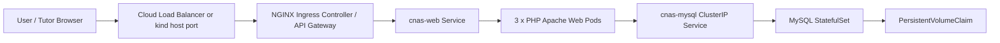
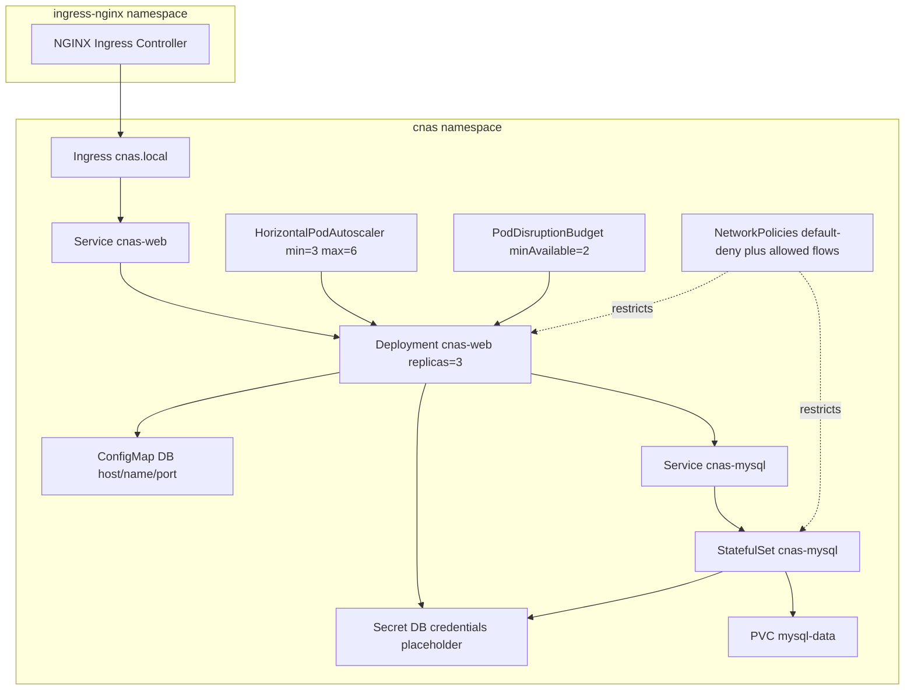
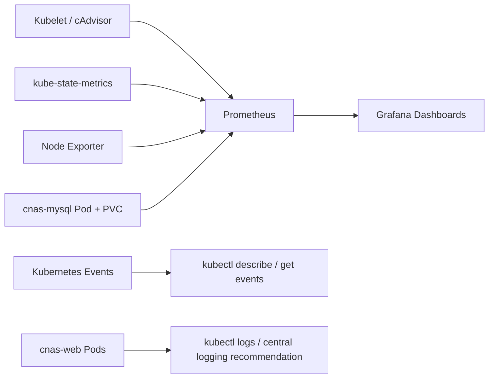

# Architecture

These diagrams can be used in the report after the team updates names, registry, hostnames, and screenshots.

## High-level application architecture

## Kubernetes deployment view

## CI/CD flow

```mermaid
flowchart LR
    Dev["Developer Commit"] --> GitHub["GitHub Repository"]
    GitHub --> Validate["PHP lint + Compose check + K8s validation"]
    Validate --> Build["Docker Build"]
    Build --> Scan["Trivy Image Scan"]
    Scan --> Push["Push Image to Registry on main"]
    Push --> Gate["Protected Deployment Environment"]
    Gate --> Deploy["kubectl apply to Kubernetes"]
    Deploy --> Rollout["Rollout Status + Audit Trail"]
```

## Monitoring flow

## Design notes

- The web tier is stateless and horizontally scalable.
- The MySQL tier uses persistent storage so pod restart does not remove data.
- NGINX Ingress is the API gateway and external routing component.
- In the school VMware plan, NGINX Ingress is exposed through NodePort, following the Week 12 practical.
- Internal load balancing is provided by Kubernetes Services across the web pods. If a true `LoadBalancer` Service is required, MetalLB can be added as an optional enhancement.
- For production database high availability, use managed MySQL or a MySQL operator with replication. This assignment implementation keeps the database simple and demonstrable.
