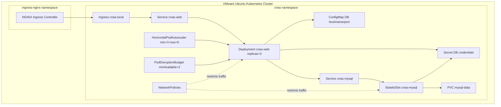

# Cloud Native Application and Security Assignment Report

## Cover Page

**School:** School of Infocomm Technology  
**Diploma:** Diploma in CyberSecurity and Digital Forensics  
**Module:** Cloud Native Application and Security  
**Academic Year/Semester:** 2026/27 Semester 5  
**Assignment:** CNAS Assignment  
**Class:** T01
**Team:** TEAM_5  
**Members:** May Cherry Aung
             Aw Ming Jie
             Abin Aneesh
             Gandhimathi Murugavel Dhushyanth  


> **Screenshot placeholder S00:** Final application home page showing the class, team number, and member names after placeholders are updated.

## Table of Contents

1. Executive Summary
2. Requirements Interpretation
3. Proposed Solution Overview
4. Architecture Design
5. Tools and Technologies Used
6. Application Implementation
7. Docker Implementation
8. VMware Ubuntu Kubernetes Cluster Setup
9. Kubernetes Implementation
10. High Availability, Scalability, Resiliency, and Load Balancing
11. Security Implementation
12. Monitoring and Auditing
13. Secure CI/CD Pipeline
14. Testing and Validation
15. Problems Encountered and Resolutions
16. Requirement Mapping
17. Demonstration Plan
18. Individual Contributions
19. Gen-AI Usage Reflection
20. Conclusion
21. References

## 1. Executive Summary

This report describes the implementation of a cloud native PHP-MySQL CRUD application for the CNAS Assignment 2026/27 Semester 5. The original requirement is to deploy a two-tier web database application using Docker and Kubernetes, while incorporating cloud native features such as high availability, scalability, resiliency, security, load balancing, monitoring, auditing, and a secure CI/CD pipeline.

The implemented solution uses a PHP Apache web application container and a MySQL database container. The application provides CRUD functions to create, read, update, and delete team member records. The application code was improved to use prepared SQL statements, environment-based database configuration, basic input validation, HTML output escaping, and a health endpoint for Kubernetes probes.

For local testing, Docker Compose is used to run the web and MySQL containers together with a persistent MySQL volume. For the Kubernetes implementation, the selected deployment environment is the existing VMware Ubuntu kubeadm cluster completed during the school practical labs. The cluster uses one master/control-plane VM and two child/worker VMs: `vm-master`, `vm-childnode1`, and `vm-childnode2`.

The Kubernetes design deploys the web tier with three replicas behind a ClusterIP Service. NGINX Ingress Controller acts as the API gateway and routing layer and is exposed using the NodePort method practised in Week 12. Kubernetes Services provide internal load balancing across ready pods. A HorizontalPodAutoscaler is prepared to scale the web tier based on CPU usage. A PodDisruptionBudget protects minimum availability during voluntary disruptions. MySQL is deployed as a StatefulSet with a PersistentVolumeClaim backed by a local PersistentVolume on `vm-childnode1` so that data can survive database pod restarts.

Security controls are applied at application, container, Kubernetes, and CI/CD levels. These include prepared statements, no database passwords hardcoded in PHP code, Kubernetes Secret placeholders, non-root web container execution, resource requests and limits, dropped Linux capabilities, disabled service account token automounting, NetworkPolicy restrictions, image vulnerability scanning with Trivy, and Kubernetes manifest validation with kubeconform.

Monitoring is planned using kube-prometheus-stack, which includes Prometheus and Grafana. The monitoring plan focuses on pod CPU and memory usage, pod restarts, deployment replica availability, node resource usage, MySQL availability, persistent storage status, Kubernetes events, and CI/CD audit logs.

> **Screenshot placeholder S01:** Screenshot of the final VMware Kubernetes cluster nodes using `kubectl get nodes -o wide`.

## 2. Requirements Interpretation

The assignment brief requires the team to act as cloud native application consultants for CNA Pte Ltd. The provided sample application is a PHP and MySQL CRUD application. The application must be deployed using Docker and Kubernetes and must demonstrate practical understanding of cloud native architecture and security.

The core requirements interpreted from the assignment are:

| Requirement area | Interpretation for this project |
| --- | --- |
| Application | Implement the PHP-MySQL CRUD application using the required files: `db.php`, `index.php`, `create.php`, `update.php`, `delete.php`, and `users.sql`. |
| Docker | Build a container image for the PHP web application and provide Docker Compose for local testing with MySQL. |
| Kubernetes | Deploy the app on a Kubernetes cluster with multiple worker nodes. |
| Cluster nodes | Use at least two to three worker nodes. This project uses VMware Ubuntu VMs. |
| API gateway and load balancer | Use NGINX Ingress Controller as the API gateway, exposed through NodePort as practised in Week 12. Kubernetes Services provide internal load balancing across pods. |
| High availability | Run at least three web replicas and protect availability using Services and a PodDisruptionBudget. |
| Resiliency | Use readiness and liveness probes, Deployment self-healing, and MySQL persistent storage. |
| Scalability | Use a HorizontalPodAutoscaler and resource requests/limits. |
| Security | Use secure coding practices, Secrets, NetworkPolicies, restricted pod contexts, and CI/CD security checks. |
| Monitoring and auditing | Use Prometheus/Grafana, Kubernetes events, logs, and CI/CD run logs. |
| CI/CD | Automate build, validation, vulnerability scanning, image push, and deployment steps. |
| Report and demo | Provide diagrams, explanations, screenshots, setup steps, testing evidence, and demonstration commands. |

## 3. Proposed Solution Overview

The proposed solution is a two-tier cloud native application:

- **Web tier:** PHP 8.3 with Apache, packaged in a Docker container.
- **Database tier:** MySQL 8.4, deployed locally through Docker Compose and in Kubernetes through a StatefulSet.
- **Kubernetes cluster:** Existing VMware Ubuntu kubeadm cluster from the school practical with one master node and two worker nodes.
- **Gateway/load balancer:** NGINX Ingress Controller exposed through NodePort, plus Kubernetes Service load balancing across web pods.
- **Monitoring:** Prometheus and Grafana using kube-prometheus-stack.
- **CI/CD:** GitHub Actions as the pipeline for validation, image build, vulnerability scanning, image push, and deployment.

The design is intentionally simple enough to demonstrate during a 20-25 minute presentation, while still addressing the assignment's cloud native and security requirements.

## 4. Architecture Design

### 4.1 High-Level Architecture

```mermaid
flowchart LR
    User["User / Tutor Browser"] --> NodePort["Master Node IP + Ingress NodePort"]
    NodePort --> Ingress["NGINX Ingress Controller / API Gateway"]
    Ingress --> WebSvc["cnas-web Kubernetes Service"]
    WebSvc --> WebPods["3 x PHP Apache Web Pods"]
    WebPods --> MySQLSvc["cnas-mysql ClusterIP Service"]
    MySQLSvc --> MySQL["MySQL StatefulSet"]
    MySQL --> PVC["PersistentVolumeClaim"]
```



> **Screenshot placeholder S02:** Architecture diagram exported from this report or recreated in Word/PowerPoint.

### 4.2 Kubernetes Deployment View



### 4.3 Design Rationale

The web tier is stateless, so it can safely run multiple replicas. Kubernetes Service load balancing distributes traffic across ready web pods. If a web pod fails, the Deployment controller creates a replacement pod. Readiness probes ensure traffic is routed only to pods that are ready to serve requests. Liveness probes allow Kubernetes to restart unhealthy containers.

The MySQL tier stores persistent data and is deployed as a StatefulSet with a PersistentVolumeClaim. This provides data persistence during pod restarts. For a production system, a managed database or replicated MySQL operator would be recommended, but for this assignment the single persistent MySQL StatefulSet is practical and explainable.

NGINX Ingress Controller is used as the API gateway layer. It receives HTTP traffic through the NodePort exposed in the Week 12 lab setup and routes requests to the web Service. The web Service then load balances traffic across the ready PHP pods. If a true `LoadBalancer` Service is required, MetalLB can be added as an enhancement, but the base assignment implementation follows the school practical environment.

## 5. Tools and Technologies Used

| Tool | Purpose in this project |
| --- | --- |
| PHP 8.3 Apache image | Runtime for the CRUD web application |
| MySQL 8.4 | Relational database for team member records |
| Docker | Builds the web application image |
| Docker Compose | Runs the web and database containers locally |
| VMware | Hosts Ubuntu VMs for the Kubernetes cluster |
| Ubuntu Server LTS | Operating system for master and worker VMs |
| kubeadm, kubelet, kubectl | Kubernetes setup and management tools used in the Week 11 practical |
| containerd | Container runtime used by Kubernetes nodes |
| Flannel | Pod network plugin installed in the Week 11 practical |
| kubectl | Kubernetes command-line management |
| Helm | Optional package manager for monitoring and ingress add-ons |
| NGINX Ingress Controller | API gateway and ingress routing |
| metrics-server | Provides CPU/memory metrics for HPA |
| Prometheus and Grafana | Monitoring and visualization |
| GitHub Actions | Secure CI/CD pipeline |
| Trivy | Container image vulnerability scanning |
| kubeconform | Kubernetes manifest validation |

> **Screenshot placeholder S03:** Screenshot of installed tool versions, for example `docker --version`, `kubectl version --client`, `kubeadm version`, and `kubectl get nodes -o wide`.

## 6. Application Implementation

### 6.1 Application Files

The application is implemented using the required files from the assignment brief:

| File | Purpose |
| --- | --- |
| `db.php` | Creates the MySQL database connection using environment variables. |
| `index.php` | Lists team members and provides navigation to create, update, and delete actions. |
| `create.php` | Adds a new team member using a prepared INSERT statement. |
| `update.php` | Updates an existing team member using prepared SELECT and UPDATE statements. |
| `delete.php` | Deletes a team member after confirmation using a prepared DELETE statement. |
| `users.sql` | Creates the `users` table and inserts sample placeholder records. |
| `health.php` | Health endpoint used by Docker and Kubernetes probes. |
| `style.css` | Basic styling for readable demo screens. |

### 6.2 Security Improvements in Application Code

The sample code in the assignment brief is intentionally simple. The implemented version keeps the same CRUD functionality but improves the obvious security weaknesses:

- Database credentials are not hardcoded in PHP code.
- `DB_HOST`, `DB_USER`, `DB_PASSWORD`, `DB_NAME`, and `DB_PORT` are read from environment variables.
- SQL operations use prepared statements.
- Query string `id` values are validated as positive integers.
- Displayed user values are escaped using `htmlspecialchars`.
- The delete action uses a confirmation form instead of immediately deleting through a GET request.
- A health endpoint is provided for readiness and liveness checks.

### 6.3 Database Schema

The `users.sql` file creates a database named `mydb` and a table named `users`. The table stores the member ID, name, email, created timestamp, and updated timestamp. The email field is unique to prevent accidental duplicate member records.

```sql
CREATE TABLE IF NOT EXISTS users (
    id INT AUTO_INCREMENT PRIMARY KEY,
    name VARCHAR(100) NOT NULL,
    email VARCHAR(191) NOT NULL UNIQUE,
    created_at TIMESTAMP NOT NULL DEFAULT CURRENT_TIMESTAMP,
    updated_at TIMESTAMP NOT NULL DEFAULT CURRENT_TIMESTAMP ON UPDATE CURRENT_TIMESTAMP
);
```

> **Screenshot placeholder S04:** Application home page listing team members.

> **Screenshot placeholder S05:** Create member form and successful new member shown on the home page.

> **Screenshot placeholder S06:** Update member form and updated member record.

> **Screenshot placeholder S07:** Delete confirmation page and record removed from the list.

> **Screenshot placeholder S08:** `curl` output for `health.php` and `health.php?deep=1`.

## 7. Docker Implementation

### 7.1 Dockerfile

The `Dockerfile` builds the PHP web application image using the maintained `php:8.3-apache` base image. It installs the required MySQL extensions and configures Apache to listen on port 8080 so the container can run as a non-root user.

Key Dockerfile features:

- Uses PHP 8.3 with Apache.
- Installs `mysqli` and `pdo_mysql`.
- Enables Apache headers and rewrite modules.
- Adds basic security headers.
- Runs the web process as `www-data`.
- Exposes port 8080.
- Includes a health check against `health.php`.

> **Screenshot placeholder S09:** `docker build -t cnas-php-mysql:local .` successful output.

### 7.2 Docker Compose Local Testing

The `docker-compose.yml` file defines two services:

- `web`: builds and runs the PHP application.
- `mysql`: runs MySQL 8.4 with a persistent volume and database initialization script.

The MySQL data is stored in a Docker volume named `mysql_data`, so records remain available after containers are restarted.

### 7.3 Local Setup Steps

Run these commands on a machine with Docker installed:

```bash
docker compose up --build -d
docker compose ps
curl http://localhost:8080/health.php
curl http://localhost:8080/health.php?deep=1
```

Open the application:

```text
http://localhost:8080
```

Stop the local environment:

```bash
docker compose down
```

Reset local database data only when needed:

```bash
docker compose down -v
```

> **Screenshot placeholder S10:** `docker compose ps` showing the web and MySQL services healthy.

> **Screenshot placeholder S11:** Browser showing the app running at `http://localhost:8080`.

## 8. VMware Ubuntu Kubernetes Cluster Setup

### 8.1 Existing School Lab VM Plan

This assignment reuses the VMware Ubuntu Kubernetes cluster completed in Week 11 and Week 12 practical labs.

| VM name | Role | IP address | Purpose |
| --- | --- | --- | --- |
| `vm-master` | Master/control-plane | `192.168.2.21` | Runs Kubernetes control plane and kubectl commands |
| `vm-childnode1` | Worker | `192.168.2.22` | Runs application pods |
| `vm-childnode2` | Worker | `192.168.2.23` | Runs application pods |

This setup is suitable because the assignment requires a Kubernetes cluster with at least two to three worker nodes. The current lab environment has two worker nodes, which satisfies the minimum requirement.

> **Screenshot placeholder S12:** VMware Workstation showing `vm-master`, `vm-childnode1`, and `vm-childnode2` powered on.

### 8.2 Completed Week 11 Setup

The Week 11 practical already covered the base Kubernetes cluster setup:

- Swap disabled on all nodes.
- Unique hostnames configured.
- `/etc/hosts` configured for name resolution.
- Docker installed on all nodes.
- containerd configured with systemd cgroup support.
- `kubeadm`, `kubelet`, and `kubectl` installed.
- Master node initialized using `kubeadm init`.
- Flannel network plugin installed.
- Worker nodes joined to the cluster.
- NGINX Deployment and NodePort Service tested.
- Pod self-healing tested by deleting a pod.

Verify the cluster on `vm-master`:

```bash
kubectl get nodes -o wide
kubectl cluster-info
kubectl get pods -A
```

> **Screenshot placeholder S13:** `kubectl get nodes -o wide` showing `vm-master`, `vm-childnode1`, and `vm-childnode2` as Ready.

### 8.3 Completed Week 12 Security Setup

The Week 12 practical already introduced security and monitoring features useful for this assignment:

- SecurityContext
- Pod Security Admission
- RBAC authorization
- NGINX Ingress Controller
- TLS with self-signed certificate
- Prometheus and Grafana monitoring

These lab activities provide direct evidence and knowledge that can be reused in the assignment explanation.

### 8.4 Local Storage Preparation for MySQL

A kubeadm cluster usually does not include a default dynamic StorageClass. The assignment MySQL StatefulSet needs persistent storage, so this project includes a local PersistentVolume:

```text
k8s/local-storage.yaml
```

It creates storage on `vm-childnode1` using:

```text
/mnt/cnas-mysql
```

Prepare the folder on `vm-childnode1`:

```bash
sudo mkdir -p /mnt/cnas-mysql
sudo chown -R 999:999 /mnt/cnas-mysql
sudo chmod 700 /mnt/cnas-mysql
```

Check whether a StorageClass already exists:

```bash
kubectl get storageclass
```

If no default StorageClass exists, use the provided `cnas-local-storage` StorageClass and `cnas-mysql-pv` PersistentVolume.

> **Screenshot placeholder S14:** `kubectl get storageclass` and `kubectl get pv,pvc -n cnas` after deployment.

### 8.5 NGINX Ingress Controller

The Week 12 practical installed NGINX Ingress Controller and exposed it through NodePort. Check it:

```bash
kubectl get svc -n ingress-nginx ingress-nginx-controller
kubectl get pods -n ingress-nginx
```

Record the HTTP NodePort. The assignment Ingress uses:

```text
cnas.local
```

Add this entry to `/etc/hosts` on the testing machine:

```text
192.168.2.21 cnas.local
```

Test access after deployment:

```bash
curl -H "Host: cnas.local" http://192.168.2.21:HTTP_NODEPORT/health.php
curl -H "Host: cnas.local" http://192.168.2.21:HTTP_NODEPORT/health.php?deep=1
```

> **Screenshot placeholder S15:** NGINX Ingress Controller Service showing the HTTP NodePort.

### 8.6 Optional TLS

The Week 12 lab showed how to create a self-signed TLS certificate. The same approach can be used for this assignment.

Create a certificate:

```bash
openssl req -x509 -nodes -days 365 -newkey rsa:2048 \
  -keyout tls.key -out tls.crt \
  -subj "/CN=cnas.local/O=cnas.local"
```

Create a TLS Secret:

```bash
kubectl -n cnas create secret tls cnas-tls-secret --cert=tls.crt --key=tls.key
```

If HTTPS evidence is required, add a TLS section to the Ingress manifest and capture browser or curl evidence.

### 8.7 metrics-server for HPA

The HPA needs CPU metrics. Check:

```bash
kubectl top nodes
kubectl top pods -n cnas
```

If this fails, install metrics-server:

```bash
kubectl apply -f https://github.com/kubernetes-sigs/metrics-server/releases/latest/download/components.yaml
kubectl -n kube-system rollout status deployment/metrics-server --timeout=180s
```

> **Screenshot placeholder S16:** `kubectl top nodes` showing CPU and memory metrics.

## 9. Kubernetes Implementation

### 9.1 Namespace

The application runs in a dedicated namespace named `cnas`. This keeps the assignment resources separated from system components.

File:

```text
k8s/namespace.yaml
```

### 9.2 ConfigMap and Secret

Non-sensitive database configuration is stored in a ConfigMap:

```text
k8s/configmap.yaml
```

Sensitive values are represented in a Secret template:

```text
k8s/secret-template.yaml
```

The Secret file uses safe placeholder values. Real passwords must be created locally and should not be committed to Git.

### 9.3 MySQL StatefulSet and Service

MySQL is deployed using:

```text
k8s/mysql-statefulset.yaml
k8s/mysql-service.yaml
k8s/mysql-initdb-configmap.yaml
```

The StatefulSet uses a PersistentVolumeClaim to store database files. This allows data to survive MySQL pod restarts.

### 9.4 Web Deployment and Service

The web tier is deployed using:

```text
k8s/web-deployment.yaml
k8s/web-service.yaml
```

The Deployment runs three web replicas. The Service provides stable internal access and load balances traffic across ready pods.

### 9.5 Ingress/API Gateway

The Ingress resource is defined in:

```text
k8s/ingress.yaml
```

It routes requests for `cnas.local` to the web Service. NGINX Ingress Controller acts as the API gateway layer.

### 9.6 HPA and PDB

The HPA is defined in:

```text
k8s/hpa.yaml
```

It scales the web Deployment from three to six replicas based on CPU utilization.

The PodDisruptionBudget is defined in:

```text
k8s/pdb.yaml
```

It keeps at least two web pods available during voluntary disruptions.

### 9.7 NetworkPolicy

Network policies are defined in:

```text
k8s/networkpolicy.yaml
```

The policy design:

- Denies unnecessary ingress and egress by default.
- Allows DNS egress.
- Allows ingress traffic to the web tier only from the `ingress-nginx` namespace.
- Allows web pods to connect to MySQL on port 3306.
- Allows MySQL ingress only from the web tier.

### 9.8 Deploy the Application to Kubernetes

Build and push the image to a registry, or import it into containerd on both worker nodes. The registry approach is recommended because it is cleaner for CI/CD evidence.

Example with a registry:

```bash
docker build -t ghcr.io/TODO_OWNER/TODO_REPO:latest .
docker push ghcr.io/TODO_OWNER/TODO_REPO:latest
kubectl apply -k k8s
kubectl -n cnas set image deployment/cnas-web web=ghcr.io/TODO_OWNER/TODO_REPO:latest
kubectl -n cnas rollout status deployment/cnas-web --timeout=180s
```

Verify:

```bash
kubectl -n cnas get pods -o wide
kubectl -n cnas get svc,ingress,hpa,pdb,pvc
kubectl -n cnas describe deployment cnas-web
```

Add a local hosts entry:

```text
LOAD_BALANCER_IP cnas.local
```

Test access:

```bash
curl -H "Host: cnas.local" http://LOAD_BALANCER_IP/health.php
curl -H "Host: cnas.local" http://LOAD_BALANCER_IP/health.php?deep=1
```

> **Screenshot placeholder S17:** `kubectl -n cnas get pods -o wide` showing web and MySQL pods.

> **Screenshot placeholder S18:** `kubectl -n cnas get svc,ingress,hpa,pdb,pvc`.

> **Screenshot placeholder S19:** Browser showing the app through `http://cnas.local`.

## 10. High Availability, Scalability, Resiliency, and Load Balancing

### 10.1 High Availability

The web tier runs three replicas. If one web pod fails, the Deployment controller automatically creates a replacement. The Kubernetes Service continues to route traffic to healthy pods.

The PodDisruptionBudget requires at least two web pods to remain available during voluntary disruptions. This helps protect service availability during maintenance operations.

### 10.2 Scalability

The HPA is configured with:

- Minimum replicas: 3
- Maximum replicas: 6
- CPU target: 60 percent average utilization

When CPU usage increases, the HPA can increase the number of web pods.

### 10.3 Resiliency

Resiliency is implemented through:

- Liveness probes to restart unhealthy containers.
- Readiness probes to prevent traffic from reaching unready pods.
- Deployment self-healing to replace failed web pods.
- MySQL PersistentVolumeClaim to preserve database data during pod restarts.
- Resource requests and limits to reduce resource contention.

### 10.4 Load Balancing

Load balancing occurs at multiple levels:

| Layer | Load balancing mechanism |
| --- | --- |
| External access | NGINX Ingress Controller is exposed through NodePort, following the Week 12 practical. |
| API gateway/routing | NGINX Ingress routes HTTP traffic to the correct Kubernetes Service. |
| Internal service | `cnas-web` Service load balances traffic across ready web pods. |
| Pod scaling | HPA increases web pod replicas during higher load. |

### 10.5 Demo Commands

Self-healing:

```bash
kubectl -n cnas get pods
kubectl -n cnas delete pod -l app.kubernetes.io/name=cnas-web
kubectl -n cnas get pods -w
```

Manual scaling:

```bash
kubectl -n cnas scale deployment/cnas-web --replicas=5
kubectl -n cnas get pods -o wide
kubectl -n cnas scale deployment/cnas-web --replicas=3
```

HPA load test:

```bash
kubectl -n ingress-nginx run hey --rm -i --restart=Never --image=rakyll/hey -- \
  -z 2m -c 50 http://cnas-web.cnas.svc.cluster.local/
kubectl -n cnas get hpa -w
```

MySQL persistence test:

```bash
kubectl -n cnas delete pod cnas-mysql-0
kubectl -n cnas rollout status statefulset/cnas-mysql --timeout=180s
```

> **Screenshot placeholder S20:** Before and after pod deletion showing Kubernetes self-healing.

> **Screenshot placeholder S21:** Manual scaling to five replicas.

> **Screenshot placeholder S22:** HPA output before and during load.

> **Screenshot placeholder S23:** MySQL pod restart with application data still available.

## 11. Security Implementation

### 11.1 Application Security

The PHP application uses prepared statements for database operations. This reduces SQL injection risk because user input is passed as bound parameters rather than concatenated into SQL strings.

The application validates `id` query parameters as positive integers. This prevents invalid values from being used in database queries.

Output is escaped using `htmlspecialchars`, reducing the risk of stored or reflected cross-site scripting when member names or emails are displayed.

### 11.2 Secret Management

Database connection details are supplied through environment variables. The PHP code does not hardcode the database password. In Kubernetes, database credentials are represented using a Secret template with placeholder values.

For final deployment, the team should create real secrets directly in the cluster:

```bash
kubectl -n cnas create secret generic cnas-db-secret \
  --from-literal=MYSQL_ROOT_PASSWORD='REPLACE_WITH_REAL_ROOT_PASSWORD' \
  --from-literal=MYSQL_USER='cnas_user' \
  --from-literal=MYSQL_PASSWORD='REPLACE_WITH_REAL_APP_PASSWORD' \
  --from-literal=DB_USER='cnas_user' \
  --from-literal=DB_PASSWORD='REPLACE_WITH_REAL_APP_PASSWORD'
```

Real secrets should not be committed to Git.

### 11.3 Container Security

The web container is configured to run as `www-data` instead of root. Apache listens on port 8080 so it does not need privileged port binding. The Kubernetes pod security context also disables privilege escalation and drops Linux capabilities.

### 11.4 Kubernetes Security

Kubernetes security controls include:

- Dedicated namespace.
- Dedicated ServiceAccount for the web tier.
- ServiceAccount token automount disabled.
- No unnecessary RBAC permissions.
- Resource requests and limits.
- Security contexts.
- NetworkPolicies limiting pod-to-pod communication.
- Secret template for sensitive values.

### 11.5 Network Security

The NetworkPolicy design follows least privilege:

- The web tier can receive traffic only from the ingress namespace.
- The database tier can receive traffic only from the web tier.
- The web tier can connect to MySQL only on port 3306.
- DNS egress is allowed because pods need service name resolution.

### 11.6 CI/CD Security

The GitHub Actions pipeline includes:

- PHP syntax validation.
- Docker Compose configuration validation.
- Kubernetes manifest validation.
- Docker image build.
- Trivy image vulnerability scanning.
- Image push only on the `main` branch.
- Kubernetes deployment through a protected environment.

> **Screenshot placeholder S24:** Code snippet showing prepared statements and escaped output.

> **Screenshot placeholder S25:** Kubernetes pod security context from `kubectl describe pod` or manifest.

> **Screenshot placeholder S26:** `kubectl -n cnas get networkpolicy`.

> **Screenshot placeholder S27:** Trivy scan output from CI/CD.

## 12. Monitoring and Auditing

### 12.1 Monitoring Stack

The monitoring stack uses kube-prometheus-stack, which includes Prometheus, Grafana, Alertmanager, kube-state-metrics, and node exporter.

Install with Helm:

```bash
helm repo add prometheus-community https://prometheus-community.github.io/helm-charts
helm repo update
helm upgrade --install cnas-monitoring prometheus-community/kube-prometheus-stack \
  --namespace monitoring \
  --create-namespace \
  -f monitoring/kube-prometheus-stack-values.yaml
```

Access Grafana locally:

```bash
kubectl -n monitoring port-forward svc/cnas-monitoring-grafana 3000:80
```

Open:

```text
http://localhost:3000
```

### 12.2 Critical Metrics

| Metric area | Metrics to monitor | Reason |
| --- | --- | --- |
| Web pods | CPU, memory, restarts, readiness | Shows health and performance of the web tier. |
| Deployment | desired replicas, available replicas | Confirms high availability. |
| HPA | current CPU, desired replicas | Shows autoscaling behavior. |
| Nodes | CPU, memory, disk, pod count | Shows cluster capacity. |
| MySQL | pod status, restarts, storage usage | Shows database availability and persistence. |
| Ingress | request rate, errors, latency if configured | Shows gateway health. |
| Kubernetes events | scheduling, probe failures, image pull errors | Helps troubleshoot and audit cluster activity. |

### 12.3 Auditing Plan

Auditing evidence is collected from:

- Kubernetes logs:

```bash
kubectl -n cnas logs deployment/cnas-web
kubectl -n cnas logs statefulset/cnas-mysql
```

- Kubernetes events:

```bash
kubectl -n cnas get events --sort-by=.lastTimestamp
```

- CI/CD pipeline logs from GitHub Actions.
- Trivy scan output.
- Kubernetes manifest validation output.

For production, Kubernetes API audit logs and centralized log collection should be enabled.

> **Screenshot placeholder S28:** Grafana dashboard showing node CPU and memory.

> **Screenshot placeholder S29:** Grafana dashboard showing namespace `cnas` pod health.

> **Screenshot placeholder S30:** Kubernetes events after self-healing demo.

## 13. Secure CI/CD Pipeline

### 13.1 Pipeline Overview

The CI/CD pipeline is implemented using GitHub Actions in:

```text
.github/workflows/ci-cd.yml
```

The pipeline performs validation, build, scanning, image push, and deployment steps.

```mermaid
flowchart LR
    Commit["Commit / Pull Request"] --> Checkout["Checkout"]
    Checkout --> Lint["PHP Syntax Check"]
    Lint --> Compose["Docker Compose Config Check"]
    Compose --> K8s["Kubernetes Manifest Validation"]
    K8s --> Build["Docker Image Build"]
    Build --> Scan["Trivy Scan"]
    Scan --> Push["Push Image on main"]
    Push --> Gate["Protected Deployment Environment"]
    Gate --> Deploy["Deploy to Kubernetes"]
```



### 13.2 Pipeline Stages

| Stage | Purpose |
| --- | --- |
| Checkout | Retrieves the source code and records the commit used for the build. |
| PHP syntax check | Catches syntax errors before building the container image. |
| Docker Compose config check | Validates local container orchestration configuration. |
| Kubernetes manifest validation | Uses kubeconform to check Kubernetes YAML. |
| Docker build | Builds the application image. |
| Trivy scan | Fails the pipeline on high or critical vulnerabilities. |
| Image push | Pushes tagged images to the registry only from `main`. |
| Deploy | Applies Kubernetes manifests and waits for rollout status. |

### 13.3 Secure Pipeline Configuration

The deployment stage should use:

- Branch protection on `main`.
- A protected GitHub environment named `production`.
- Repository or environment secret `KUBE_CONFIG_DATA`.
- Registry authentication through GitHub Container Registry or another approved registry.

Create `KUBE_CONFIG_DATA`:

```bash
base64 -w 0 ~/.kube/config
```

On Windows PowerShell:

```powershell
[Convert]::ToBase64String([IO.File]::ReadAllBytes("$env:USERPROFILE\.kube\config"))
```

> **Screenshot placeholder S31:** GitHub Actions successful workflow run.

> **Screenshot placeholder S32:** Pipeline log showing PHP syntax check and Kubernetes validation.

> **Screenshot placeholder S33:** Pipeline log showing Docker image build and Trivy scan.

> **Screenshot placeholder S34:** Image pushed to registry, if the push step is enabled.

## 14. Testing and Validation

### 14.1 Local Docker Testing

| Test | Command | Expected result |
| --- | --- | --- |
| Build and run app | `docker compose up --build -d` | Web and MySQL containers start. |
| Check services | `docker compose ps` | Containers are healthy or running. |
| Health check | `curl http://localhost:8080/health.php` | Returns `status: ok`. |
| Deep health check | `curl http://localhost:8080/health.php?deep=1` | Returns database `ok`. |
| CRUD test | Browser create/update/delete | Records change correctly. |

### 14.2 Kubernetes Testing

| Test | Command | Expected result |
| --- | --- | --- |
| Node verification | `kubectl get nodes -o wide` | Master and 2-3 workers are Ready. |
| Pod verification | `kubectl -n cnas get pods -o wide` | Web and MySQL pods are Running. |
| Service verification | `kubectl -n cnas get svc` | Web and MySQL Services exist. |
| Ingress verification | `kubectl -n cnas get ingress` | Ingress points to `cnas-web`. |
| Health check | `curl -H "Host: cnas.local" http://LOAD_BALANCER_IP/health.php` | Returns healthy response. |
| Self-healing | Delete web pod | Replacement pod is created. |
| Scaling | Scale web Deployment | Replica count changes. |
| HPA | Run load test | HPA metrics update and may scale pods. |
| Persistence | Delete MySQL pod | Data remains after pod restart. |

### 14.3 Smoke Test Scripts

The project includes smoke test scripts:

```text
scripts/smoke-test.sh
scripts/smoke-test.ps1
```

Linux/macOS:

```bash
bash scripts/smoke-test.sh http://localhost:8080
```

PowerShell:

```powershell
.\scripts\smoke-test.ps1 -BaseUrl http://localhost:8080
```

Optional CRUD smoke test:

```bash
RUN_CRUD=1 bash scripts/smoke-test.sh http://localhost:8080
```

> **Screenshot placeholder S35:** Smoke test output.

## 15. Problems Encountered and Resolutions

Only include real problems encountered during your implementation. Do not invent issues. The table below is a template.

| Problem | Cause | Resolution | Evidence |
| --- | --- | --- | --- |
| TODO_PROBLEM_1 | TODO_CAUSE | TODO_RESOLUTION | TODO_SCREENSHOT_OR_COMMAND |
| TODO_PROBLEM_2 | TODO_CAUSE | TODO_RESOLUTION | TODO_SCREENSHOT_OR_COMMAND |
| TODO_PROBLEM_3 | TODO_CAUSE | TODO_RESOLUTION | TODO_SCREENSHOT_OR_COMMAND |

Possible real examples, only if they happen:

- HPA showing `<unknown>` because metrics-server was not installed.
- Ingress access failing because the wrong NodePort or Host header was used.
- Web pods showing `ImagePullBackOff` because the image was not pushed to a registry.
- Database readiness failing because Secret values did not match MySQL credentials.
- Pods not scheduled because VMware VM resources were too low.

## 16. Requirement Mapping

| Assignment requirement | Implemented artifact | Verification evidence |
| --- | --- | --- |
| PHP-MySQL CRUD app | PHP files and `users.sql` | CRUD screenshots and health endpoint output |
| Docker deployment | `Dockerfile`, `docker-compose.yml` | Docker build and Compose screenshots |
| Kubernetes deployment | `k8s/` manifests | `kubectl get pods`, services, ingress, HPA, PDB |
| 2-3 worker nodes | VMware Ubuntu kubeadm cluster from Week 11 practical | `kubectl get nodes -o wide` |
| API gateway | NGINX Ingress Controller | Ingress controller Service and app access |
| Load balancer | Kubernetes Service load balancing plus NGINX Ingress NodePort routing | Ingress NodePort and web Service endpoints |
| High availability | 3 web replicas, PDB | Pod list and PDB output |
| Resiliency | Probes, self-healing, PVC | Pod deletion and MySQL persistence test |
| Scalability | HPA, resource requests/limits | HPA output and load test |
| Security | Prepared statements, Secrets, NetworkPolicies, security contexts | Code snippets and Kubernetes outputs |
| Monitoring | Prometheus and Grafana | Grafana screenshots |
| Auditing | Logs, events, CI/CD logs | `kubectl logs`, events, GitHub Actions logs |
| Secure CI/CD | GitHub Actions workflow | Workflow run and scan output |
| Report and demo | Documentation and demo script | Report, diagrams, and screenshots |

## 17. Demonstration Plan

The presentation should be 20-25 minutes. Each member should explain at least one part and be ready to answer questions about the whole solution.

| Time | Segment | Suggested presenter |
| --- | --- | --- |
| 0:00-2:00 | Problem statement and architecture | TODO_MEMBER |
| 2:00-5:00 | Application and Docker demo | TODO_MEMBER |
| 5:00-10:00 | VMware Kubernetes cluster and manifests | TODO_MEMBER |
| 10:00-14:00 | HA, resiliency, scaling, and load balancing | TODO_MEMBER |
| 14:00-17:00 | Security implementation | TODO_MEMBER |
| 17:00-20:00 | Monitoring and auditing | TODO_MEMBER |
| 20:00-23:00 | CI/CD pipeline | TODO_MEMBER |
| 23:00-25:00 | Questions | All members |

Key demo commands:

```bash
kubectl get nodes -o wide
kubectl -n cnas get pods -o wide
kubectl -n cnas get svc,ingress,hpa,pdb,pvc
kubectl -n cnas delete pod -l app.kubernetes.io/name=cnas-web
kubectl -n cnas get pods -w
kubectl -n cnas scale deployment/cnas-web --replicas=5
kubectl -n cnas get hpa
kubectl -n cnas logs deployment/cnas-web
kubectl -n cnas get events --sort-by=.lastTimestamp
```

## 18. Individual Contributions

Fill this honestly based on actual work done by each member.

| Member | Main contribution | Evidence |
| --- | --- | --- |
| TODO_MEMBER_1 | TODO | TODO |
| TODO_MEMBER_2 | TODO | TODO |
| TODO_MEMBER_3 | TODO | TODO |
| TODO_MEMBER_4 | TODO | TODO |

## 19. Gen-AI Usage Reflection

### 19.1 Which Gen-AI tool did you use?

TODO: State the tool used, for example Codex/ChatGPT, and include required screenshots of prompts and outputs.

### 19.2 How did you use the Gen-AI tool?

Codex was used to help structure the project files, improve the PHP sample application security, prepare Docker and Kubernetes manifests, draft documentation, prepare a report outline, and create demo/evidence checklists. The team still needs to run the implementation, capture real screenshots, verify commands, and understand the final solution before demonstration.

### 19.3 How did the Gen-AI tool enhance the assignment?

The tool helped speed up initial scaffolding and documentation. It also helped identify security improvements such as prepared statements, environment-based database configuration, output escaping, NetworkPolicy, security contexts, and CI/CD vulnerability scanning. This allowed the team to focus more time on testing, understanding, and demonstration preparation.

### 19.4 How did the Gen-AI tool hinder the assignment?

TODO: Add a truthful reflection. Possible points include: AI output still required verification, commands had to be adapted to the actual VMware environment, and the team needed to understand each generated file instead of submitting it blindly.

### 19.5 How can future Gen-AI use be improved?

TODO: Add a truthful reflection. Possible points include: provide clearer constraints earlier, test each generated step immediately, ask for explanations of unfamiliar Kubernetes objects, and keep a record of prompts and changes for academic transparency.

> **Screenshot placeholder S36:** Gen-AI prompt and output screenshots required by the assignment brief.

## 20. Conclusion

This project implements the required PHP-MySQL CRUD application using Docker and Kubernetes. The selected VMware Ubuntu cluster gives practical evidence of a multi-node Kubernetes deployment using one master/control-plane node and two worker nodes. The solution includes a containerized web application, a persistent MySQL database, Kubernetes Services, Ingress/API gateway routing through NodePort, web-tier high availability, HPA-based scaling, readiness and liveness probes, resource controls, NetworkPolicies, monitoring, auditing, and secure CI/CD gates.

The implementation is designed to be simple, explainable, and demonstrable. It avoids unrealistic production claims while still preparing strong evidence for the assignment. The main remaining work before submission is to run the full environment on VMware, capture the required screenshots, replace TODO placeholders, and rehearse the demonstration commands.

## 21. References

Docker. (n.d.). *Dockerfile reference*. https://docs.docker.com/reference/dockerfile/

Docker. (n.d.). *Docker Compose documentation*. https://docs.docker.com/compose/

Kubernetes. (n.d.). *Deployments*. https://kubernetes.io/docs/concepts/workloads/controllers/deployment/

Kubernetes. (n.d.). *Service*. https://kubernetes.io/docs/concepts/services-networking/service/

Kubernetes. (n.d.). *Ingress*. https://kubernetes.io/docs/concepts/services-networking/ingress/

Kubernetes. (n.d.). *Horizontal Pod Autoscaling*. https://kubernetes.io/docs/concepts/workloads/autoscaling/horizontal-pod-autoscale/

Kubernetes. (n.d.). *Network Policies*. https://kubernetes.io/docs/concepts/services-networking/network-policies/

Kubernetes. (n.d.). *Creating a cluster with kubeadm*. https://kubernetes.io/docs/setup/production-environment/tools/kubeadm/create-cluster-kubeadm/

Flannel. (n.d.). *Flannel networking for Kubernetes*. https://github.com/flannel-io/flannel

Ingress-NGINX Controller. (n.d.). *Installation Guide*. https://kubernetes.github.io/ingress-nginx/deploy/

Prometheus Community. (n.d.). *kube-prometheus-stack Helm chart*. https://github.com/prometheus-community/helm-charts/tree/main/charts/kube-prometheus-stack

GitHub Docs. (n.d.). *GitHub Actions documentation*. https://docs.github.com/en/actions

Trivy. (n.d.). *Trivy documentation*. https://trivy.dev/docs/latest/

kubeconform. (n.d.). *Kubernetes manifest validation tool*. https://github.com/yannh/kubeconform
