# Secure CI/CD Plan

GitHub Actions is the primary pipeline for this project.

## Pipeline diagram

```mermaid
flowchart LR
    Commit["Commit / Pull Request"] --> Checkout["Checkout"]
    Checkout --> Lint["PHP Syntax Check"]
    Lint --> Compose["Docker Compose Config Check"]
    Compose --> K8s["Kubernetes Manifest Validation"]
    K8s --> Build["Docker Build"]
    Build --> Scan["Trivy Vulnerability Scan"]
    Scan --> Push["Push Image on main"]
    Push --> Approval["Protected Environment Gate"]
    Approval --> Deploy["Deploy to Kubernetes"]
    Deploy --> Audit["Actions Logs + Rollout Status"]
```



## Controls

| Pipeline step | Security or quality purpose |
| --- | --- |
| Checkout | Gives traceability from commit to build |
| PHP syntax check | Stops broken PHP before image creation |
| Docker Compose check | Catches local orchestration mistakes |
| Kubernetes validation | Catches malformed manifests before deployment |
| Docker build | Produces an immutable release image |
| Trivy scan | Fails on high and critical image vulnerabilities |
| Registry push | Stores versioned images with commit SHA tags |
| Protected deploy | Prevents uncontrolled deployment to cluster |
| Rollout status | Verifies the deployment becomes healthy |

## Required GitHub configuration

- Enable GitHub Actions.
- Use GitHub Container Registry or update `REGISTRY`.
- Protect the `main` branch.
- Add a protected environment named `production`.
- Add `KUBE_CONFIG_DATA` as a base64-encoded kubeconfig secret only if the team will use automated deployment.

Create `KUBE_CONFIG_DATA`:

```bash
base64 -w 0 ~/.kube/config
```

On Windows PowerShell:

```powershell
[Convert]::ToBase64String([IO.File]::ReadAllBytes("$env:USERPROFILE\.kube\config"))
```

## Evidence to capture

- Pull request or commit that triggered the workflow
- Successful PHP syntax check
- Successful Kubernetes validation
- Docker image build log
- Trivy scan result
- Image pushed to registry
- Deployment approval and rollout status, if deployment is enabled

## Important limitation

Do not claim the pipeline deployed to a cloud cluster unless it actually ran against a real cluster. If only validation and image build were run, state that clearly in the report.
